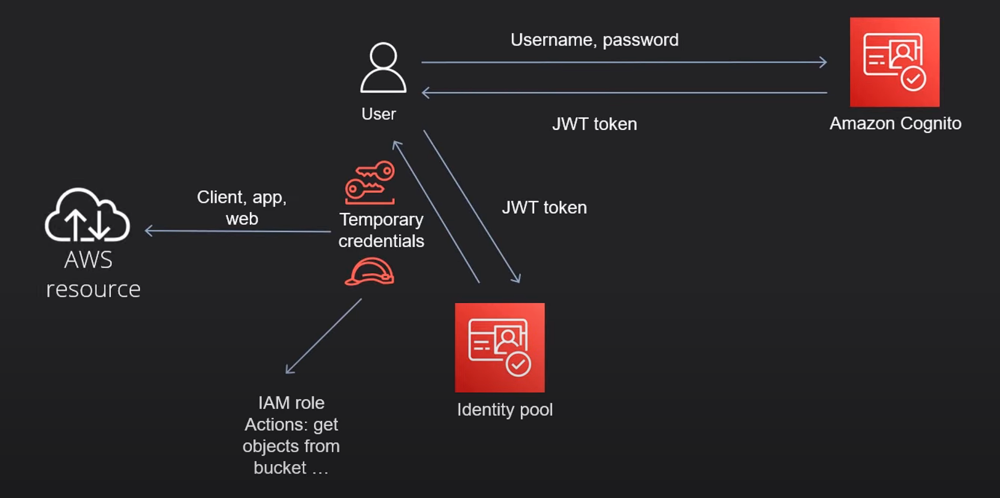

# AWS Cognito

## GitHub repo

https://github.com/nirgluzman/AWS-Cognito-DemoApp.git

## Training resources

- https://youtu.be/-l0fKbdE-d4 (tutorial by Alex Dan)
- https://github.com/alexhddev/Cognito-course

## Amazon Cognito

https://docs.aws.amazon.com/cognito/

## Cognito Main Components

- `User Pools` -> handle user authentication (sign-up/sign-in).

  - Store user data.
  - Basic authN solution (JWT tokens).

- `Identity Pools` -> grant access to AWS resources.
  - Fine grained access control (authZ) - user assumes an identity.
  - Can directly call AWS SDK commands - access AWS resources.

## Cognito User Pools

- User directory - rich set of features.
- It is an OpenID Connect (OICD) identity pool provider (IdP).
- Other identity providers: Google, Facebook, GitHub etc.
- We can login with these providers into Cognito.

- `User pool groups` enables us to create and manage groups, add users to groups, and remove users
  from groups. We use groups to create collections of users to manage their permissions or to
  represent different types of users.

 

## Cognito Identity Pools

- Provides temporary access to AWS resources - e.g.: files stored in an S3 bucket.

- Identity Pools are for granting access to AWS resources to authenticated users or unauthenticated
  guests.

- Requires installing `@aws-sdk/client-cognito-identity` to obtain Cognito credentials.

## Integrating Cognito authN & authZ with web and mobile apps

https://docs.aws.amazon.com/cognito/latest/developerguide/cognito-integrate-apps.html

- Configure Amplify, https://docs.amplify.aws/gen1/javascript/tools/libraries/configure-categories/

## Cognito Tokens

https://docs.aws.amazon.com/cognito/latest/developerguide/amazon-cognito-user-pools-using-tokens-with-identity-providers.html

Tokens authenticate users and grant access to resources. The claims in tokens are information about
the user.

- `idToken` - contains claims about the identity, e.g. username, family name, and email address.
- `accessToken` - grants access to protected resources.
- `refreshToken` - used to obtain new access tokens when the current one expires.

## `aws-amplify` Package for authN

- `aws-amplify` primarily focuses on User Pool authentication (sign-up, sign-in, token management).
  It's designed for managing user identities.
- We cannot directly retrieve the Identity Pool credentials using `aws-amplify` methods.

## JavaScript Packages for authZ

- To work directly with Identity Pool credentials we need `@aws-sdk/client-cognito-identity` and
  `@aws-sdk/credential-providers` packages.
- We'll often use User Pool tokens (which `aws-amplify` helps us get) as input when requesting
  credentials from the Identity Pool.
