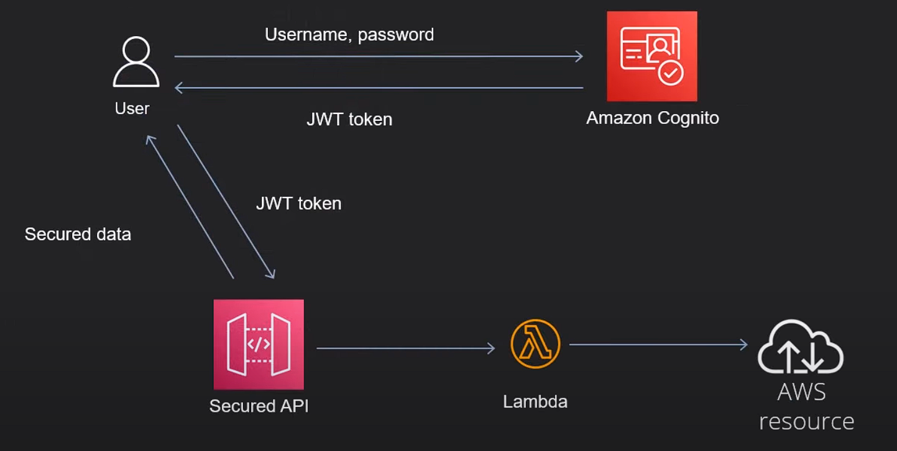
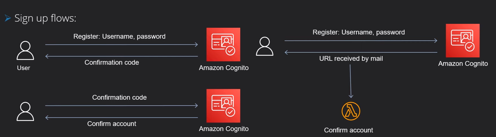

# AWS Cognito

## GitHub repo

https://github.com/nirgluzman/AWS-Cognito-DemoApp.git

## Training resources

- https://youtu.be/-l0fKbdE-d4 (tutorial by Alex Dan)
- https://github.com/alexhddev/Cognito-course

## Amazon Cognito

https://docs.aws.amazon.com/cognito/

## Cognito Main Components

- User pools:
  - Store user data.
  - Basic authN solution (JWT tokens).
- Identity pools:
  - Fine grained access control (authZ) - user assumes an identity.
  - Can directly call AWS SDK commands - access AWS resources.

## Cognito User Pools

- User directory - rich set of features.
- It is an OpenID Connect (OICD) identity pool provider (IdP).
- Other identity providers: Google, Facebook, GitHub etc.
- We can login with these providers into Cognito.

 

## Cognito Identity Pool

## Integrating Cognito authN & authZ with web and mobile apps

https://docs.aws.amazon.com/cognito/latest/developerguide/cognito-integrate-apps.html

- Configure Amplify, https://docs.amplify.aws/gen1/javascript/tools/libraries/configure-categories/
